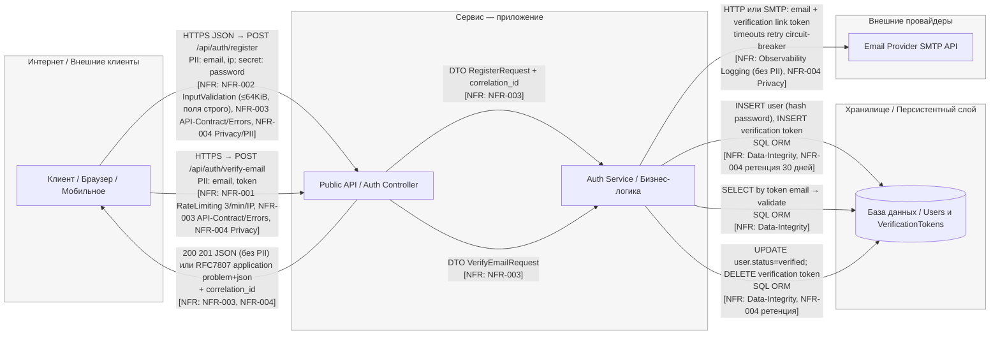
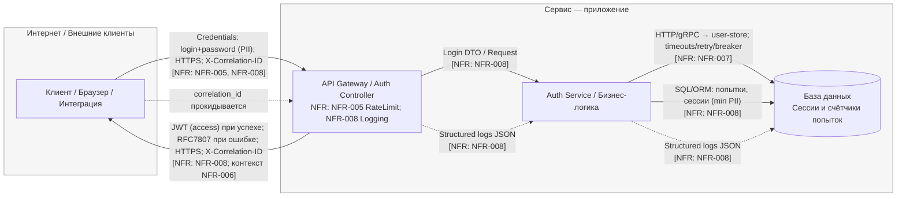
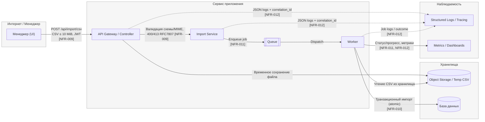

# TM - Требования безопасности + Модель угроз + ADR

---

## 0) Мета

- **Проект :** учебный шаблон
- **Версия :** v1 / 2025-10-12
- **Кратко :** Онлайн магазин для b2с сегмента

---
## 1) Архитектура и границы доверия (TM1, S04)

- **Роли/активы:**  клиенты (браузер, мобильные устройства), админ; PII (email, IP), а также токены для верификации и пароли (хешированные)
- **Зоны доверия:** Internet (Внешний доступ через API, публичные эндпоинты)/ DMZ / Internal (Сервисная логика, базовые данные, внешние провайдеры, например почта / Storage (База данных для хранения пользователей и токенов)
- **Context/DFD:**

Для Use Case "Регистрация пользователей" 

Для Use Case "Вход в систему" 

Для Use Case "Импорт CSV"

- **Критичные интерфейсы и допущения:**  
  Доверенные: API gateway, сервисы внутри приложения, авторизация, база данных. 
  Недоверенные: Клиенты (внешние), внешний почтовый провайдер.

---

## 2) Реестр угроз STRIDE (TM2, TM3, S04)

_Минимум: закрыть все буквы **S, T, R, I, D, E**. Оценки **L/I** по шкале 1-5._

| ID  | STRIDE | Компонент/поток                         | Угроза (кратко)                                                            | L | I | L×I |
|-----|--------|-----------------------------------------|----------------------------------------------------------------------------|---|---|-----|
| T01 | **S**  | API → User (JWT)                        | Повтор/подмена украденного или просроченного JWT (replay/validation gaps). | 4 | 5 | 20  |
| T02 | **T**  | API GW/Auth (Rate limiting)             | Обход лимитов через spoof `X-Forwarded-*`/прокси.                          | 4 | 4 | 16  |
| T03 | **R**  | Node: API                               | Отсутствие трассировки загрузок → нельзя доказать источник                 | 3 | 3 | 9   |
| T04 | **I**  | API/Service Logs & Errors, API→Client   | Утечка PII через логи и ответы:                                            | 4 | 4 | 16  |
| T05 | **D**  | Internet→API (/verify-email, /register) | Abuse/DoS публичных auth-эндпоинтов                                        | 4 | 4 | 16  |
| T06 | **E**  | Node: DB                                | Прямой импорт/запись админом минуя сервис                                  | 2 | 4 | 8   |

**сюда в таблицу еще добавить ADR (ту что использовал для ADR)

---

## 3) Приоритизация и Top-5 _(TM3, S04)_
1) **T01 JWT replay/validation gaps.** - L×I=20;  Почему: частая недонастройка валидации токена; ущерб критичный (неавторизованный доступ).
2) **T02 Обход rate limit спуфингом заголовков.** - L×I=16; Почему: ставит под угрозу все меры против перебора.  
3) **T05 Abuse/DoS публичных auth-эндпоинтов** - L×I=16; Почему: публичная поверхность, простая автоматизация → L=4; блокирует ключевой путь онбординга → I=4.  
4) **T04 PII-утечки через логи/ошибки** - L×I=16; Почему: часто встречается и масштабируемо (массовые логи) → L=4; приватность/комплаенс-удар → I=4. 
---

## 4) Требования (S03) и ADR-решения (S05) под Top-5 (TM4)

### NFR-001 Защита от DDoS/Грязных данных (NFR-001/NFR-002 из EVIDENCE)

- **AC (GWT):**
  - **Given** ip адрес  **When** выполняется limit+N запросов к <endpoint> за 60 секунд  **Then** лишние запросы получают 429 и корректный заголовок Retry-After
  - **Given** тело запроса размером 128 KiB **When** `POST /api/auth/register` **Then** ответ **413** с телом в RFC 7807 
  - **Given** тело с незадекларированным полем `debug` **When** `POST /api/auth/register` **Then** **400** в RFC 7807; схема DTO отклоняет неизвестные поля.

### NFR-002 Отсутствие утечек/Приватность/комплаенс (NFR-003/NFR-004 из EVIDENCE)

- **AC (GWT):**
  - **Given** серверная ошибка при `POST /api/auth/register` **When** клиент получает ответ **Then** `Content-Type=application/problem+json`, присутствуют `type/title/status/detail`, нет стэктрейсов, есть `correlation_id`
  - **Given** бизнес-ошибка в `POST /api/auth/verify-email` **Then** тело также соответствует RFC 7807.
  - **Given** DTO с `email` и `ip` **When** выполняется логирование на любом уровне **Then** поля PII замаскированы/отсутствуют; 
  - **Given** учётная запись осталась неподтверждённой **When** проходит 30 дней **Then** запись и связанный verification-токен удаляются согласно политике ретенции; наличие задания ретенции проверяемо.

### NFR-003. Базовая линия безопасности, предотвращение неавторизованных действий. (NFR-006 из EVIDENCE)

- **AC (GWT):**
  - **Given** истёкший JWT, **When** `POST /api/profile` (пример write), **Then** ответ **401** с `Content-Type: application/problem+json` и полями `type/title/status/detail`, без стэктрейсов, с `correlation_id`.

### NFR-004. Снижает риск перебора паролей и DoS на точке входа. (NFR-005 из EVIDENCE)

- **AC (GWT):**
  -  **Given** валидная пара *(username, IP)* с активным лимитом, **When** выполняется **6-й** запрос к `/api/auth/login` в течение 60 с, **Then** ответ **429** с заголовком `Retry-After > 0`. **И** при 31-м запросе с одного IP за 60 с — также **429**.

---

### Краткие ADR (минимум 2) - архитектурные решения S05

#### ADR-001 - Global & per-route rate-limits + body-size limits

- **Context:** T05, NFR-001; Защита от DDoS/Грязных данных;
- **Decision:** Внедрение глобальных лимитов на количество запросов и размер тела на уровне всех auth-эндпоинтов
- **DoD:** **When**: Запросы превышают лимит по размеру или количеству ( более 64 KiB или 10 запросов/мин).
**Then**: Клиент получает ответ 429 с корректным заголовком `Retry-After`.
- **Owner:** DevSecOps
- **Evidence (план/факт):** EVIDENCE/S05_ADR_rate-limiting-auth.md

#### ADR-002 - JWT TTL + Refresh + Rotation

- **Context:** T01, NFR-003; Базовая линия безопасности, предотвращение неавторизованных действий;
- **Decision:** Защита от повторного использования украденных или просроченных JWT, а также для предотвращения атак с подменой токенов
- **DoD:** **Given** просроченный access token с истекшим сроком действия, **When** выполняется запрос к защищенному эндпойнту (`POST /api/profile`), **Then** ответ должен быть **401 Unauthorized** с `Content-Type: application/problem+json` и соответствующим сообщением об ошибке в формате RFC7807.
- **Owner:** Security Lead
- **Evidence:** EVIDENCE/ADR_jwt.md

#### ADR-003 - PII Secrets + Redaction Filter

- **Context:** T04, NFR-008; Приватность и комплаенс. Риск утечки PII или секретов (пароль, токен, email) в логах при ошибках или отладке; нарушение политики безопасности и требований GDPR.
- **Decision:** Внедрить централизованное маскирование PII и секретов через denylist-фильтр (`password`, `email`, `token`, `ip`, `secret`) на уровне лог-middleware. Все значения заменяются на `***` до сериализации JSON; стэктрейсы исключаются, ошибки оформляются в RFC7807.
- **DoD:** **Given** лог содержит поля `password` и `email`, **When** сервис записывает сообщение уровня ERROR или INFO, **Then** эти поля заменяются на `***` и отсутствуют в сохранённом JSON-логе; проверка успешности — поиск по ключам возвращает 0 совпадений.
- **Owner:** DevSecOps Lead
- **Evidence:** EVIDENCE/ADR_pii-secrets.md

---

## 5) Трассировка Threat → NFR → ADR → (План)Проверки (TM5)

| Threat | NFR     | ADR     | Чем проверяем (план/факт)                                                                                                                                                                                                                |
|-------:|---------|---------|------------------------------------------------------------------------------------------------------------------------------------------------------------------------------------------------------------------------------------------|
|    T05 | NFR-001 | ADR-001 | e2e-тесты на лимит запроса и тела. Проверка на соответствие конфигурации лимитов в API Gateway. Слежение за количеством 429 ответов, недопущение превышения 5% от всех запросов.                                                         |
|    T01 | NFR-003 | ADR-002 | Интеграционные тесты, проверяющие, что просроченные JWT приводят к **401 Unauthorized**. Токены должны проверяться против списка отзыва refresh токенов. Ошибки проверки JWT должны составлять не более **1%** от общего числа запросов. |
|    T04 | NFR-008 | ADR-003 | e2e-тест, который анализирует JSON-логи и подтверждает отсутствие полей из списка password, email, token, secret                                                                                                                         |

---

## 6) План проверок (мост в DV/DS)

- **SAST/Secrets/SCA:** TODO: инструменты и куда положите отчёты в `EVIDENCE/`
- **SBOM:** TODO: генератор/формат
- **DAST (если применимо):** TODO: стенд/URL; профиль
- **Примечание:** на этапе TM допустимы черновые планы/ссылки; финальные отчёты появятся в **DV/DS**.

---
