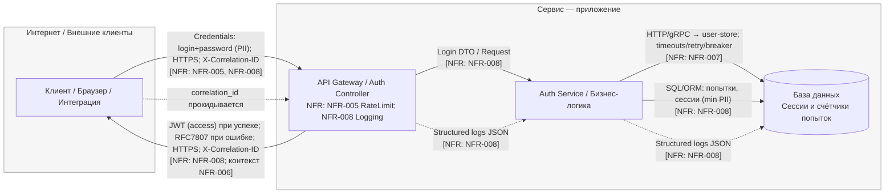

---

## STRIDE для DFD «US-002 — Вход в систему»

| Element                                             | Data/Boundary                       | Threat (S/T/R/I/D/E) | Description                                                          | NFR link (ID)                  | Mitigation idea (ADR later)                                                           |
| --------------------------------------------------- | ----------------------------------- | -------------------- | -------------------------------------------------------------------- | ------------------------------ | ------------------------------------------------------------------------------------- |
| **Edge: Internet → API**                            | Credentials (login+password), HTTPS | S                    | Credential stuffing/подмена идентичности через массовый перебор пар. | NFR-005 (#128)                 | Rate limit per (username, IP); IP-wide лимиты; CAPTCHA/step-up после порога.          |
| **Edge: Internet → API**                            | Credentials (PII)                   | D                    | DoS/ресурсное истощение на `/api/auth/login` всплеском запросов.     | NFR-005 (#128)                 | Throttling 429 + Retry-After; защитные очереди на gateway.                            |
| **Edge: Internet → API**                            | Request                             | T                    | Манипуляция входным телом/заголовками (несанкционированные поля).    | need NFR (InputValidation)     | JSON schema/DTO strict, запрет extra полей, лимит размеров.                           |
| **Edge: Internet → API**                            | Response                            | I                    | Утечка деталей ошибок (стэктрейсы, причины отказа) при логине.       | NFR-006 (#129), NFR-008 (#131) | RFC7807 без стэктрейсов; единый error-mapper в gateway.                               |
| **Edge: Internet → API**                            | Response (JWT)                      | S                    | Подмена/повтор использования просроченного/украденного JWT.          | NFR-006 (#129)                 | Короткий TTL access, refresh flow, проверка `iss/aud/exp`, revoke по спискам.         |
| **Node: API Gateway / Auth Controller**             | Boundary: Internet↔Service          | R                    | Отрицание действий: отсутствие `correlation_id` в логах запроса.     | NFR-008 (#131)                 | Генерация/прокидывание `X-Correlation-ID`, шаблон логов JSON.                         |
| **Node: API Gateway / Auth Controller**             | Rate limiting                       | T                    | Обход rate limit через вариации заголовков/проксей.                  | NFR-005 (#128)                 | Нормализация IP/Forwarded, ключ (username, IP CIDR), защита от X-Forwarded-For spoof. |
| **Node: API Gateway / Auth Controller**             | Logs                                | I                    | Пароли/секреты попадают в логи.                                      | NFR-008 (#131)                 | Маскирование чувствительных полей, denylist ключей, unit-тесты логов.                 |
| **Edge: API → Service (Auth Service)**              | Login DTO                           | T                    | Подмена полей DTO для обхода проверок (напр., пустой пароль).        | need NFR (InputValidation)     | Валидация DTO на уровне схемы; обязательные поля; negative-tests.                     |
| **Edge: API → Service**                             | Errors                              | R                    | Отсутствует трассировка ошибок между слоями.                         | NFR-008 (#131)                 | Прокидка `correlation_id` сквозь Service; унифицированный middleware.                 |
| **Edge: Service → DB (Sessions/Attempts)**          | SQL/ORM                             | T                    | SQL-инъекция/манипуляция счётчиками попыток.                         | need NFR (Data-Integrity)      | Параметризация, ограничения БД (CHECK/UNIQUE), миграции, тесты.                       |
| **Edge: Service → DB (Sessions/Attempts)**          | PII-min at rest                     | I                    | Неумышленное хранение PII в записях сессий/логах.                    | need NFR (Privacy/PII)         | Минимизация/ретенция, шифрование столбцов, TTL очистки.                               |
| **Node: DB (Sessions/Attempts)**                    | Access                              | R                    | Нет аудита админ-операций/правок попыток.                            | need NFR (Auditability)        | Audit trail (actor, action, target, time, result), неизменяемое хранилище.            |
| **Node: DB (Sessions/Attempts)**                    | Capacity                            | D                    | Блокировки/контеншн при пиках записи попыток логина.                 | NFR-005 (#128)                 | Батч/дедуп по ключу, индексы, лимит RPS на Service.                                   |
| **Edge: API → User (Response)**                     | JWT                                 | I                    | «Толстый» JWT с PII внутри claims.                                   | NFR-006 (#129)                 | Минимальный набор claims: `sub, iat, exp, iss, aud`; без PII.                         |
| **Edge: API → User (Response)**                     | Error (RFC7807)                     | R                    | Клиент не может сопоставить инцидент без `correlation_id`.           | NFR-008 (#131)                 | Добавлять `correlation_id` в problem+json; корреляция с логами.                       |
| **Edge: API → User (Response)**                     | Headers                             | S                    | Replay ответов через кэш/прокси.                                     | need NFR (HTTP Cache)          | `Cache-Control: no-store` на `/login`, одноразовые nonce.                             |
| **Logs (сквозной поток)**                           | JSON logs                           | I                    | PII/секреты в логах при ошибках аутентификации.                      | NFR-008 (#131)                 | Маскирование, redaction-фильтры, тесты шаблонов логов.                                |
| **Logs (сквозной поток)**                           | JSON logs                           | R                    | Отрицание действий из-за неполных событий (success/failure).         | NFR-008 (#131)                 | Логировать outcome (success/error code), user-id (без PII), `correlation_id`.         |
---
## Приоритизация рисков L×I «US-002 — Вход в систему»
| Risk ID  | Source (DFD/Row)                     | Consolidated Description                                                   | Threat (S/T/R/I/D/E) | NFR link (ID)              | L (1-5) | Rationale-L                                               | I (1-5) | Rationale-I                                     | **Score (=L×I)** | Decision (Top-5?)                     | ADR candidate                                     |
| -------- | ------------------------------------ | -------------------------------------------------------------------------- | -------------------- | -------------------------- | ------: | --------------------------------------------------------- | ------: | ----------------------------------------------- | ---------------: | ------------------------------------- | ------------------------------------------------- |
| **R-01** | Edge: Internet → API (Credentials)   | Массовый подбор (credential stuffing) на `/api/auth/login`.                | S                    | **NFR-005 (#128)**         |       5 | Публичная точка входа, типовой сценарий атак.             |       4 | Возможен компромисс аккаунтов/блокировки.       |           **20** | **Top-5**                             | **RateLimit per (username,IP) + step-up**         |
| **R-02** | Edge: API → User (JWT)               | Повтор/подмена украденного или просроченного JWT (replay/validation gaps). | S                    | **NFR-006 (#129)**         |       4 | Часто встречается при слабых TTL/проверках `iss/aud/exp`. |       5 | Неавторизованный доступ к данным/операциям.     |           **20** | **Top-5**                             | **JWT TTL+Refresh, strict validation, revoke**    |
| **R-03** | Edge: Internet → API (RPS)           | DoS/истощение ресурса всплеском логин-запросов.                            | D                    | **NFR-005 (#128)**         |       4 | Лёгкая автоматизация, цель — «горячая» точка.             |       4 | Недоступность логина, косвенно — всего сервиса. |           **16** | **Top-5**                             | **429 + Retry-After, глобальные квоты**           |
| **R-04** | Node: API GW/Auth (Rate limiting)    | Обход лимитов через spoof `X-Forwarded-*`/прокси.                          | T                    | **NFR-005 (#128)**         |       4 | Частый обход в периметре с прокси/CDN.                    |       4 | Сводит на нет защиту от перебора/DoS.           |           **16** | **Top-5**                             | **Trusted proxies, IP normalization, sticky-key** |
| **R-05** | Logs (сквозной поток)                | Секреты/PII в логах (пароль, hash, salt).                                  | I                    | **NFR-008 (#131)**         |       3 | Ошибки маскировки встречаются нередко.                    |       4 | Регуляторные последствия/утечки.                |           **12** | **Top-5** *(по комплаенс-тайбрекеру)* | **PII/Secrets Redaction Policy**                  |
| **R-06** | Edge: Service → DB (SQL/ORM)         | Тамперинг/SQL-инъекции в счётчиках попыток/сессиях.                        | T                    | need NFR (Data-Integrity)  |       3 | Внутренний слой, но риск при слабой валидации.            |       4 | Обход блокировок/порогов, эскалация атак.       |               12 | Consider                              | **Parametrized ORM + DB constraints**             |
| **R-07** | Node: Auth Service (CPU/hash)        | Алгоритмический DoS на дешёвых параметрах хеширования.                     | D                    | **NFR-005 (#128)**         |       3 | Всплески провоцируют перегрев CPU.                        |       4 | Деградация/таймауты аутентификации.             |               12 | Consider                              | **Argon2id cost tuning + adaptive backoff**       |
| **R-08** | Edge: API → Service (DTO)            | Невалидный/расширенный DTO (extra fields/overlong body).                   | T                    | need NFR (InputValidation) |       3 | Типовой баг при слабых схемах.                            |       3 | Ошибки логики/краши/поверхность инъекций.       |                9 | Backlog                               | **Strict DTO schema + size limits**               |
| **R-09** | Edge: Internet → API (Errors)        | Утечка внутренних деталей в ошибках логина.                                | I                    | **NFR-008 (#131)**         |       3 | Часто всплывает при exception-to-response.                |       3 | Раскрытие конфигурации/поведения.               |                9 | Backlog                               | **RFC7807 mapper (no stack traces)**              |
| **R-10** | Edge: API → User (HTTP cache)        | Replay/кеширование ответов `/login`.                                       | S                    | need NFR (HTTP Cache)      |       2 | Требует специф. условий/проксирования.                    |       3 | Срыв UX/потенциальные логические дыры.          |                6 | Backlog                               | **Cache-Control: no-store + nonce**               |
| **R-11** | Node: API GW/Auth (Tracing)          | Нет `correlation_id` → плохая трассировка/оспоримость.                     | R                    | **NFR-008 (#131)**         |       3 | Частая недонастройка логирования.                         |       2 | Влияет на расследование, не на доступ.          |                6 | Backlog                               | **Mandatory correlation_id middleware**           |
| **R-12** | Edge: Service → DB (PII-min at rest) | Избыточная PII в сессиях/логах/таблицах.                                   | I                    | need NFR (Privacy/PII)     |       3 | Практика «логировать всё».                                |       4 | Комплаенс/репутационные риски.                  |               12 | Consider                              | **PII minimization + retention/TTL**              |
| **R-13** | Node: DB (Access/Audit)              | Нет аудита правок флагов/политик блокировок.                               | R                    | need NFR (Auditability)    |       2 | Админ-доступ ограничен, но возможен.                      |       4 | Трудно расследовать/оспорить изменения.         |                8 | Backlog                               | **Immutable audit trail for admin ops**           |
| **R-14** | Edge: API → User (JWT claims)        | «Толстый» JWT (PII в claims).                                              | I                    | **NFR-006 (#129)**         |       3 | Частая ошибка проектирования.                             |       3 | Утечки при логировании/пересылке.               |                9 | Backlog                               | **Minimal claims set (no PII)**                   |
---

## STRIDE для DFD «US-013 — Импорт CSV»

| Element                   | Data/Boundary  | Threat (S/T/R/I/D/E) | Description                                                  | NFR link (ID) | Mitigation idea (ADR later)                   |
| ------------------------- | -------------- | -------------------- | ------------------------------------------------------------ |---------------| --------------------------------------------- |
| **Edge: User → API**      | HTTPS / CSV    | **T**                | Подмена содержимого CSV, инъекция формата, превышение лимита | NFR-009       | Schema & size validation, reject extra cols   |
|                           |                | **D**                | Массовая загрузка больших файлов → истощение ресурсов        | NFR-009       | Rate limit + async upload queue               |
| **Node: API**             | Controller     | **R**                | Отсутствие трассировки загрузок → нельзя доказать источник   | NFR-012       | Structured JSON logs with correlation_id      |
| **Edge: API → Worker**    | Task JSON      | **T**                | Изменение метаданных задания (фальшивые пути/ID)             | NFR-010       | Signed payload / validation in worker         |
| **Node: Worker**          | Business logic | **I**                | Ошибка валидации → вставка неконсистентных данных            | NFR-010       | Full transactional import, rollback on fail   |
|                           |                | **D**                | Большие CSV или бесконечные задачи блокируют очередь         | NFR-011       | Background scaling, queue timeout             |
| **Edge: Worker → DB**     | SQL            | **T**                | SQL-инъекция или частичные записи                            | NFR-010       | ORM + parameterized queries, transactions     |
| **Edge: Worker → S3**     | File IO        | **I**                | Утечка временных CSV через S3 ACL                            | NFR-011       | Private bucket, expiring links                |
| **Node: DB**              | Data store     | **E**                | Повышение прав через ручной импорт напрямую                  | NFR-010       | Role-based DB access, readonly connections    |
| **Node: Service (общая)** | All logs       | **R/I**              | Отсутствие корреляции и аудит-следа для импорта              | NFR-012       | Logging with correlation_id, structured audit |

---

## Приоритизация рисков L×I «US-013 — Импорт CSV»

| Risk ID  | Source (DFD/Row)      | Consolidated Description                                             | Threat (S/T/R/I/D/E) | NFR link (ID) | L (1-5) | Rationale-L                                                 | I (1-5) | Rationale-I                                         | **Score (=L×I)** | Decision (Top-5?) | ADR candidate                                   |
|----------|-----------------------|----------------------------------------------------------------------|----------------------|---------------|---------|-------------------------------------------------------------|---------|-----------------------------------------------------|-----------------:|-------------------|-------------------------------------------------|
| **R-15** | Edge: User → API      | Массовая загрузка CSV >10 MiB → DoS на точке входа `/api/import/csv` | D                    | **NFR-009**   | 4       | Публичный эндпоинт, легко автоматизируется (боты, скрипты). | 4       | Отказ в обслуживании, блокировка очереди и API.     |           **16** | **Top-5**         | **Upload-RateLimit + async queue**              |
| **R-16** | Edge: User → API      | Подмена CSV / инъекция данных (SQL/скрипты) до валидации             | T                    | **NFR-009**   | 3       | Требует злонамеренного файла, но реально при слабой схеме.  | 5       | Нарушение целостности БД, внедрение вредных данных. |           **15** | **Top-5**         | **Strict CSV schema + MIME allowlist**          |
| **R-17** | Node: Worker → DB     | Частичный импорт / потеря атомарности при ошибках                    | T                    | **NFR-010**   | 3       | Возможен при сбое валидации или транзакции.                 | 5       | Потеря консистентности данных во всех таблицах.     |           **15** | **Top-5**         | **Transactional import rollback**               |
| **R-18** | Node: Worker / Queue  | Перегрузка очереди, фоновые таймауты, блокировка задач               | D                    | **NFR-011**   | 3       | Реально при пиковых загрузках больших CSV.                  | 4       | Задержки и накопление фоновых заданий, потеря SLA.  |           **12** | **Top-5**         | **Autoscaling + back-pressure control**         |
| **R-19** | Node: Service (общая) | Утечка PII или содержимого CSV в логах                               | I                    | **NFR-012**   | 3       | Может произойти при ошибке логирования.                     | 4       | Раскрытие персональных данных, регуляторные риски.  |           **12** | **Top-5**         | **PII masking + structured logs**               |
| **R-20** | Edge: Worker → S3     | Неверные ACL → доступ к временным CSV извне                          | I                    | **NFR-011**   | 2       | Ограниченная поверхность (S3 internal).                     | 4       | Возможна утечка CSV с клиентскими данными.          |                8 | Consider          | **Private bucket + expiring links**             |
| **R-21** | Node: DB              | Прямой импорт/запись админом минуя сервис                            | E                    | **NFR-010**   | 2       | Требует внутреннего доступа.                                | 4       | Нарушение целостности, обход проверок.              |                8 | Backlog           | **Role-based DB access, read-only connections** |
| **R-22** | Node: API             | Нет трассировки загрузок, нельзя связать с пользователем             | R                    | **NFR-012**   | 3       | Часто забывают логировать context_id.                       | 3       | Сложность расследований/оспаривания действий.       |                9 | Backlog           | **Audit log + correlation_id**                  |

---

### Сводка Top-5

* **Top-1: R-01 — Credential stuffing.** Высокая вероятность (публичная поверхность, автоматизируется) × высокий ущерб (компромисс учёток/блокировки). **ADR:** *RateLimit per (username,IP) + step-up/CAPTCHA*.
* **Top-2: R-02 — JWT replay/validation gaps.** Частая недонастройка валидации токена; ущерб критичный (неавторизованный доступ). **ADR:** *JWT TTL+Refresh, strict claims check, revoke lists*.
* **Top-3: R-03 — DoS логина.** Всплески на `/login` валят UX и могут аффектить весь сервис. **ADR:** *429 + Retry-After, глобальные квоты/очереди*.
* **Top-4: R-04 — Обход rate limit спуфингом заголовков.** Ставит под угрозу все меры против перебора. **ADR:** *Trusted proxies, IP normalization, sticky key (username, CIDR)*.
* **Top-5: R-05 — PII/секреты в логах.** Сильный комплаенс- и репутационный риск; обнаружить можно не сразу. **ADR:** *PII/Secrets Redaction Policy + контракт-тесты логов*.

---